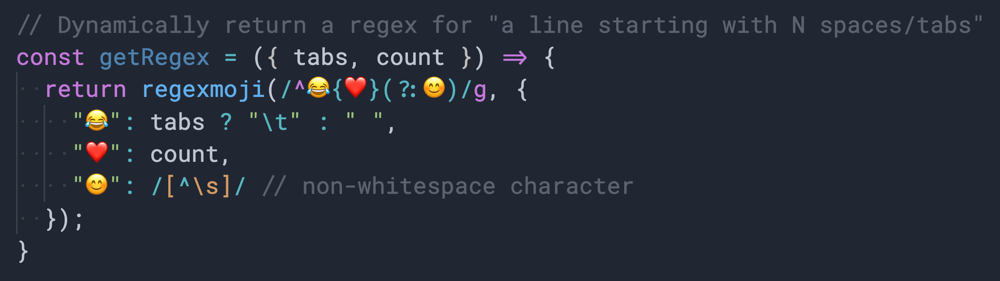

# regexmoji
# 
**regexmoji** is an experimental module. Its main goal is to make regular expressions easier to read and maintain. 
Just like how in CoffeeScript, [annotating regular expressions](http://coffeescript.org/#regexes) is possible (and I love that), with this plugin you can do this in vanilla JS. Also, a key advantage over CoffeeScript is that, it can also reduce repetition.

### Usage 
This is one of the most confusing email validation patterns i can find online:

```
/[a-z0-9!#$%&'*+/=?^_`{|}~-]+(?:\.[a-z0-9!#$%&'*+/=?^_`{|}~-]+)*@(?:[a-z0-9](?:[a-z0-9-]*[a-z0-9])?\.)+[a-z0-9](?:[a-z0-9-]*[a-z0-9])?/g
```

With **regexmoji**, it can reduce to:
```js
import regexmoji from 'regexmoji'

regexmoji(
  /💜(?:\.💜)*@(?:💚(?:💧💚)?\.)+💚(?:💧💚)?/g,
  {
    "💚": /[a-z0-9]/, // alphanumeric (single)
    "💧": /[a-z0-9-]*/, // alphanumeric and dash (multi)
    "💜": /[a-z0-9!#$%&'*+/=?^_`{|}~-]+/, // stuff
  }
);
```

It became easier to read, and even entertaining! This is just like a RegExp equivalent of [template literals](https://developer.mozilla.org/en-US/docs/Web/JavaScript/Reference/Template_literals). I wish they existed. However, even if they existed, they would look something like this:
```js
RegExp`/${C}(?:\.${C})*@(?:${A}(?:${B}${A})?\.)+${A}(?:${B}${A})?/g`
```
So I like this emoji approach better. Especially visually.

## API
Basic usage:
```js
import regexmoji from 'regexmoji'
let regex = regexmoji(inputRegex, dictionary)
```
Shorthand:
```js
import {rm} from 'regexmoji'
let regex = rm(inputRegex, dictionary)
```
Custom, re-usable:
```js
import {create} from 'regexmoji'
let rm = create(dictionary)
let regex1 = rm(inputRegex1)
let regex2 = rm(inputRegex2)
```

## See Also

- https://github.com/rauschma/re-template-tag
- http://xregexp.com
- https://github.com/shannonmoeller/regx
